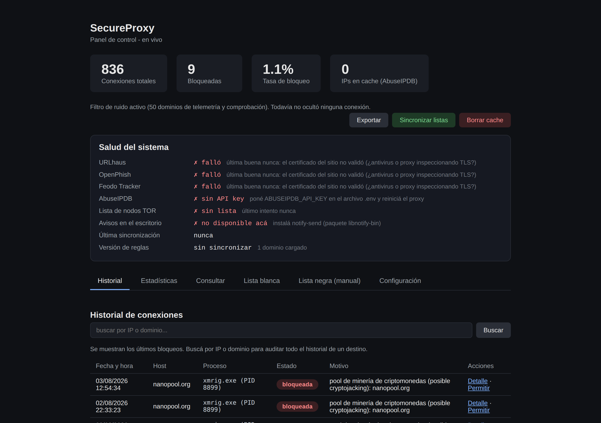
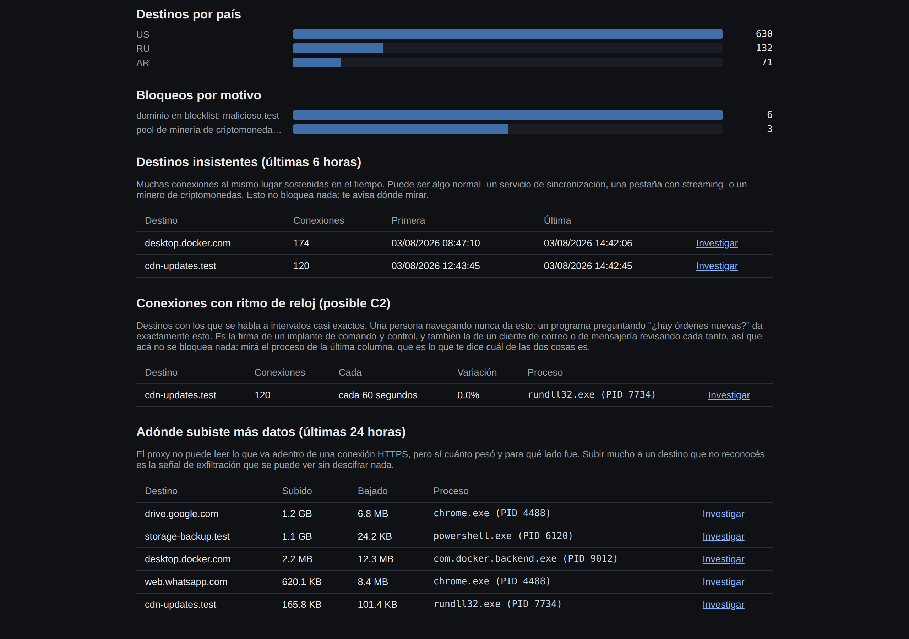
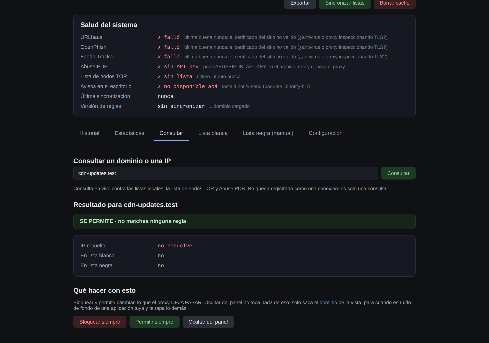
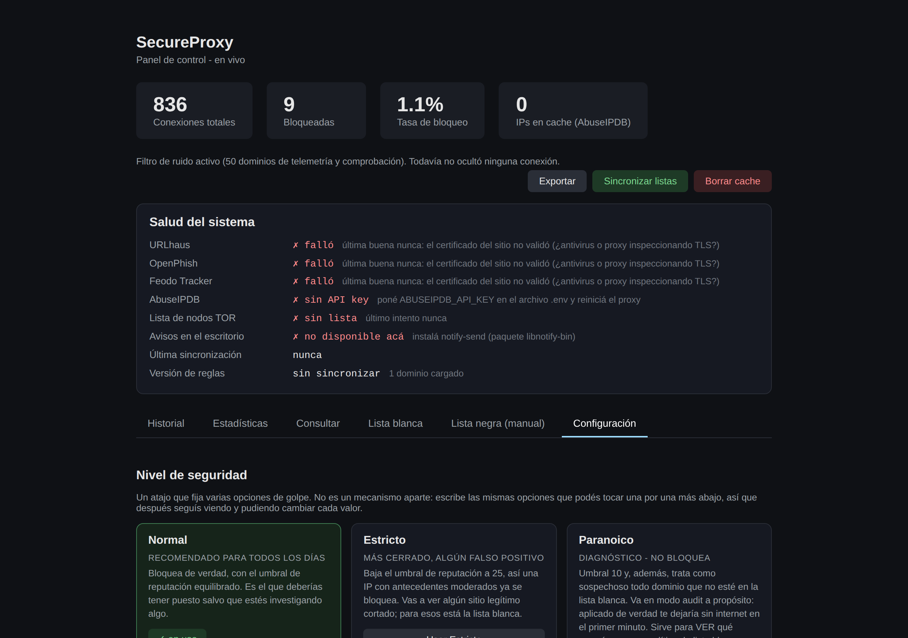

# SecureProxy


Proxy HTTP/HTTPS de filtrado con inteligencia de amenazas en tiempo real,
pensado como una capa de un stack personal de seguridad en profundidad
("defense in depth"): junto con [SecureDNS](https://github.com/matiaselebi/secure-dns)
(filtrado a nivel de resolución de nombres) y
[SecureVPN](https://github.com/matiaselebi/secure-vpn) (transporte cifrado),
cada proyecto cubre una capa distinta del tráfico de red de una sola máquina,
sin superponerse entre sí. Los tres se encienden y se miran juntos desde
[SecureCenter](https://github.com/matiaselebi/secure-center). Ver
"Limitaciones" más abajo para qué es y qué no es este proyecto.

Combina una lista negra de dominios (curada a mano y alimentada por feeds
públicos como URLhaus y OpenPhish), una lista de IPs de servidores de
comando-y-control de botnets (Feodo Tracker), rangos de red de mala
reputación (FireHOL), una lista de pools de minería para detectar
cryptojacking, reputación de IP vía AbuseIPDB (con circuit breaker si la API
falla, ver más abajo), y detección de nodos de salida TOR. Las listas
automáticas se actualizan solas en segundo plano al arrancar el proxy y cada
6 horas mientras corre.

Cada conexión queda registrada con el proceso que la abrió, cuánto subió y
bajó, y la IP de destino con su país, ASN y proveedor, resueltos contra una
base local: nunca se consulta una API por conexión. Sobre esos datos hay dos
detectores de comportamiento, uno por volumen y otro por regularidad, que no
dependen de ninguna lista.

## El panel

Historial de conexiones, con el proceso que abrió cada una y el detalle
completo a un clic:



Detección por comportamiento, que no depende de ninguna lista. Acá se ve un
destino con ritmo de reloj (60 segundos exactos, 0% de variación, desde
`rundll32.exe`) y otro al que se le subió más de un giga desde
`powershell.exe`:



Consultar un destino contra todas las fuentes a la vez, y poder actuar sobre
lo que acabás de ver:



Niveles de seguridad, que fijan varias opciones de golpe en vez de dejarte
combinarlas a mano:



## Qué hace

- Actúa como **proxy directo (forward proxy)**: el cliente lo configura como
  salida a internet, y todo el tráfico HTTP/HTTPS pasa por él antes de llegar
  al destino.
- Soporta HTTP normal (GET/POST/etc.) y **HTTPS vía CONNECT** (túnel TCP, sin
  descifrar el contenido - el filtrado ocurre a nivel de dominio/IP, antes de
  abrir el túnel).
- Antes de dejar pasar una conexión, evalúa en orden:
  - **Lista blanca** (`data/allowlist.txt`): si el dominio está acá, se
    permite sin más chequeos - gana por sobre cualquiera de los siguientes.
  - **Pools de minería** (`data/mining_pools.txt`): va antes que la lista
    negra general para que el motivo del bloqueo diga "cryptojacking" y no
    un genérico "dominio en blocklist".
  - Lista negra de dominios (`data/blocklist.txt`, curada a mano, combinada
    con `data/blocklist_feeds.txt`, generada automáticamente).
  - **Dominios desconocidos**, si está activado el modo lista blanca (solo
    en el nivel Paranoico, ver más abajo).
  - Lista de IPs de C2 de botnets conocidas (`data/ip_blocklist_feeds.txt`,
    generada automáticamente desde Feodo Tracker).
  - **Rangos de red de mala reputación** (`data/ip_ranges_feeds.txt`,
    generada automáticamente desde FireHOL).
  - Si la IP de destino es un nodo de salida TOR conocido.
  - Reputación de la IP de destino contra la API de [AbuseIPDB](https://www.abuseipdb.com/)
    (con cache persistente en SQLite, ver más abajo).
- Cada conexión (permitida o bloqueada) queda registrada en SQLite con **el
  proceso que la abrió**, el volumen subido y bajado, la IP de destino, el
  país, el ASN y el proveedor, con avisos en el escritorio y la opción de
  generar/ejecutar reglas de firewall (`iptables` en Linux, `netsh
  advfirewall` en Windows) para bloqueos persistentes.

## Contexto de seguridad

Este proxy filtra tráfico hacia dominios e IPs de reputación conocida como
maliciosa, pero **no aísla la ejecución de código**: si un sitio explota una
vulnerabilidad del navegador o induce la ejecución de un binario, el proxy no
ofrece protección contra eso. Para ese escenario, la recomendación es
complementarlo con aislamiento real (una máquina virtual o contenedor
desechable, idealmente con snapshots), usando el proxy como una capa
adicional que reduce la superficie de ataque bloqueando destinos de mala
reputación antes de que lleguen al navegador.

## Limitaciones

Documentar explícitamente qué NO hace este proyecto es, a propósito, parte
del diseño (evita dar una falsa sensación de cobertura total):

- **No descifra ni inspecciona TLS** (sin MITM): el filtrado de HTTPS es por
  dominio/IP antes de abrir el túnel CONNECT, nunca por contenido de la
  página. Ver [ADR 0001](docs/adr/0001-forward-proxy-no-tls-inspection.md)
  para la justificación de esta decisión (evitar instalar una CA raíz de
  confianza en el sistema).
- **No aísla la ejecución de código** (ver "Contexto de seguridad" arriba).
- **Depende de que la aplicación respete la configuración de proxy del
  sistema**: apps que gestionan su propia conexión de red por fuera de esa
  configuración simplemente no pasan por acá (ver "Alcance del filtrado por
  proxy del sistema" más abajo).
- **La reputación de IP vía AbuseIPDB es fail-open ante fallas**: si la API
  no responde (o está en cooldown por el circuit breaker, ver más abajo),
  esa capa específica de filtrado queda temporalmente inactiva; las demás
  (blocklist de dominios, IPs de C2, TOR) siguen funcionando igual. Ver
  [ADR 0002](docs/adr/0002-abuseipdb-fail-open-circuit-breaker.md).
- **Pensado para una sola máquina**, no para ser un gateway de red para
  varios dispositivos.
- **No reemplaza un antivirus ni una VPN**: es una capa de filtrado de
  destinos de red, complementaria a esas otras capas, no un sustituto.

## Estructura del proyecto

```
secure-proxy/
├── README.md
├── requirements.txt
├── .gitignore
├── .env.example
├── config/
│   └── config.yaml          # configuración del proxy
├── data/
│   ├── blocklist.txt        # lista negra de dominios (curada a mano)
│   ├── allowlist.txt        # lista blanca de dominios (curada a mano o vía dashboard)
│   ├── mining_pools.txt     # pools de minería conocidos (cryptojacking)
│   └── noisy_domains.txt    # telemetría y comprobaciones: se ocultan del panel
├── src/secureproxy/
│   ├── __init__.py
│   ├── config_loader.py     # carga config.yaml + variables de entorno
│   ├── config_writer.py     # escribe config.yaml sin perder los comentarios
│   ├── feeds_status.py      # estado por fuente, para el panel de salud
│   ├── geoip.py             # país / ASN / proveedor de una IP, base LOCAL
│   ├── ip_ranges.py         # listas de RANGOS de IP (CIDR) con bisect
│   ├── view_prefs.py        # qué se MUESTRA en el panel (≠ qué se bloquea)
│   ├── process_lookup.py    # qué proceso abrió cada conexión (puerto -> PID)
│   ├── desktop_alerts.py    # avisos nativos del sistema, con freno anti-ruido
│   ├── http_client.py       # salidas del proxy que NO pasan por el proxy
│   ├── validation.py        # limpia y valida los dominios que se escriben
│   ├── logger_db.py         # logging estructurado en SQLite
│   ├── threat_intel.py      # AbuseIPDB + nodos TOR + blocklist + allowlist
│   ├── ip_reputation_cache.py  # cache persistente (SQLite) de scores de AbuseIPDB
│   ├── filter_engine.py     # decide permitir/bloquear una conexión
│   ├── notifier.py          # alertas por Telegram (opcional)
│   ├── firewall_rules.py    # generación/ejecución de reglas de firewall
│   └── proxy_server.py      # proxy HTTP/HTTPS (8888) + dashboard (8889)
├── scripts/
│   ├── run_proxy.py         # punto de entrada del proxy
│   ├── stop_proxy.py        # detiene el proxy por PID
│   ├── agregar_dominio.py   # alta de dominios desde el .bat, sin interpolar código
│   ├── update_geoip.py      # arma la base local de país y ASN (una vez por mes)
│   └── update_blocklist.py  # URLhaus + OpenPhish + Feodo Tracker + FireHOL
├── SecureProxy.bat          # panel de control para Windows
├── tests/
│   ├── test_filter_engine.py
│   ├── test_allowlist_and_cache.py
│   ├── test_abuseipdb_circuit_breaker.py
│   ├── test_config_panel.py
│   ├── test_no_self_proxy.py
│   ├── test_dashboard_fase1.py
│   ├── test_fase2.py
│   ├── test_filtro_de_ruido.py
│   ├── test_dominios_limpios.py
│   ├── test_fase3.py
│   ├── test_seguridad.py
│   ├── test_apagado.py
│   ├── test_validation.py
│   ├── test_logger_db.py
│   ├── test_proxy_integration.py
│   └── test_update_blocklist.py
├── deploy/
│   ├── secureproxy.service  # servicio de systemd para Linux
│   └── instalar_servicio.py # lo instala completando las rutas solo
├── docs/
│   ├── adr/                 # decisiones de diseño documentadas (ADRs)
│   └── img/                 # capturas del panel para este README
├── docker/
│   └── Dockerfile
├── LICENSE
└── .github/                 # CI + Dependabot (deps al día solas)
```

## Instalación

### Linux / macOS

```bash
git clone https://github.com/matiaselebi/secure-proxy.git
cd secure-proxy
python3 -m venv venv
source venv/bin/activate
pip install -r requirements.txt
cp .env.example .env   # completar ABUSEIPDB_API_KEY (opcional; Telegram viene desactivado)
```

#### Que arranque solo (servidor con systemd)

En una máquina que va a quedar prendida, conviene registrarlo como servicio
del sistema. `SecureProxy.bat` es de Windows y acá no sirve; el equivalente
está en `deploy/`:

```bash
sudo python3 deploy/instalar_servicio.py
```

Ese script averigua dónde está el proyecto y cuál es el python del venv,
crea un usuario de servicio sin privilegios, le da permiso de escritura
solo sobre `data/` y `config/`, y deja el servicio habilitado. Después:

```bash
systemctl status secureproxy       # ¿está corriendo?
journalctl -u secureproxy -f       # los logs, en vivo
sudo systemctl stop secureproxy    # pararlo de verdad
```

Dos cosas a tener en cuenta. **No uses `scripts/stop_proxy.py` con el
servicio activo**: ese script mata el proceso por PID y systemd lo vuelve a
levantar enseguida, porque para él eso es una caída. Y si activás
`firewall.enabled`, hay que descomentar las dos líneas de
`AmbientCapabilities` del `.service`: el servicio corre sin ese permiso a
propósito.

El archivo `deploy/secureproxy.service` se puede editar a mano en vez de
usar el instalador; tiene marcadas las tres líneas que dependen de tu
máquina. Una de sus líneas no es opcional y conviene saber por qué:
`KillSignal=SIGINT`. Systemd manda SIGTERM por defecto, y el proxy solo
maneja `KeyboardInterrupt`, que en Python es SIGINT; con SIGTERM muere con
código 143 y deja `data/proxy.pid` huérfano, así que después el panel cree
que hay un proxy corriendo que no existe.

El panel sigue escuchando solo en `127.0.0.1` a propósito. Para verlo desde
otra máquina, un túnel SSH y listo:

```bash
ssh -L 8889:127.0.0.1:8889 usuario@servidor
# y abrís http://127.0.0.1:8889/ en tu navegador
```

Exponerlo en la red **no** es una alternativa: el panel no tiene
autenticación, y las defensas contra CSRF y DNS rebinding protegen de un
navegador engañado, no de alguien que le pega directo desde la LAN.

### Windows

```powershell
git clone https://github.com/matiaselebi/secure-proxy.git
cd secure-proxy
python -m venv venv
venv\Scripts\activate
pip install -r requirements.txt
copy .env.example .env
```

## Uso

En primer plano (logs visibles en consola, se detiene con Ctrl+C):

```bash
python scripts/run_proxy.py
```

En Windows, la forma más simple es usar el panel de control: doble clic en
`SecureProxy.bat` (ver la sección siguiente).

Por defecto levanta en `127.0.0.1:8888`. Para usarlo desde un navegador:

1. **Windows**: Configuración → Red e Internet → Proxy → activar "Usar un
   servidor proxy" con dirección `127.0.0.1` y puerto `8888`. Aplica a la
   mayoría de las apps de Windows, incluidos navegadores basados en
   Chromium. También puede lanzarse el navegador directo con el proxy sin
   tocar la configuración del sistema, por ejemplo:
   `brave.exe --proxy-server="127.0.0.1:8888"`.
2. **Linux**: Configuración → Sistema → proxy, o
   `brave-browser --proxy-server="127.0.0.1:8888"`.
3. Al navegar, si un dominio está en la blocklist o tiene mala reputación,
   la conexión se rechaza y queda registrada en `data/proxy_logs.db`.

Prueba rápida con curl, sin depender del navegador:

```bash
curl -x http://127.0.0.1:8888 http://example.com
curl -x http://127.0.0.1:8888 https://example.com   # prueba el túnel CONNECT
```

### Dashboard

Con el proxy corriendo, entrando directo (sin usarlo como proxy, solo como si
fuera una página cualquiera) a `http://127.0.0.1:8889/` se ve un panel en
vivo con cuatro tarjetas -conexiones totales, conexiones bloqueadas, tasa de
bloqueo y cuántas IPs hay en el cache de AbuseIPDB- y seis pestañas:

- **Historial**: las últimas conexiones bloqueadas, cada una con un link
  "Detalle" que despliega todo lo que se sabe de esa conexión (host, puerto,
  método, ruta, cliente, motivo exacto y cuánto tardó la decisión) y un
  "Permitir". Arriba hay un **buscador por IP o dominio** que audita el
  historial completo: cuando buscás se muestran también las permitidas,
  porque auditar un destino es querer ver todo lo que hizo.
- **Estadísticas**: conexiones por hora, bloqueos por hora, top de destinos,
  destinos por país y
  bloqueos por motivo. Son consultas SQL sobre el mismo historial, dibujadas
  con barras hechas a mano: ninguna librería de gráficos.
- **Consultar**: mini-OSINT. Escribís un dominio o una IP y te dice qué opina
  cada fuente por separado -listas, Feodo, TOR, AbuseIPDB- y, sobre todo,
  **qué haría el proxy con esa conexión ahora mismo**. Es lo que sirve para
  entender un falso positivo. La consulta no queda registrada como conexión.
- **Lista blanca** y **Lista negra (manual)**: agregar un dominio con un
  formulario o sacarlo con "Quitar", sin tocar ningún archivo a mano.
- **Configuración**: las opciones del `config.yaml` que tienen utilidad real
  del otro lado de la pantalla, editables con un botón cada una (ver abajo).

Arriba a la derecha hay cuatro botones: **Exportar** -pregunta si lo querés en
CSV o en JSON y respeta el filtro del buscador, así que lo que ves es lo que
te llevás-, **Sincronizar listas** -fuerza la descarga de los cuatro feeds al
instante, sin esperar el ciclo de 6 horas ni ir al menú `.bat`-, **Borrar
cache**, que vacía el cache de reputación de IPs, y **Apagar proxy**.

#### El botón de apagar

Cierra el proceso entero desde el navegador, sin ir a la terminal ni buscar el
PID. Hace exactamente lo mismo que Ctrl+C: cierra los dos servidores, borra
`data/proxy.pid` y sale con código 0.

Tres detalles que no son obvios y por eso están resueltos:

- **Contesta antes de morirse.** Primero manda la página de despedida y recién
  medio segundo después dispara el apagado. Al revés, el proceso podía cerrarse
  antes de que la respuesta llegara y el navegador mostraba "no se puede
  conectar" justo cuando la acción había funcionado bien.
- **No usa señales.** Sería natural hacer `os.kill(os.getpid(), SIGINT)`, pero
  en Windows no existe forma limpia de mandarle SIGINT a un proceso puntual:
  `CTRL_C_EVENT` va al grupo de consola entero y se lleva puesta la terminal de
  al lado. En su lugar el panel levanta un evento y el hilo principal hace el
  mismo cierre ordenado, igual en Linux y en Windows.
- **Pasa por el chequeo anti-CSRF**, como el resto de las acciones. Sin eso,
  cualquier página que visitaras podía apagarte el proxy con un
  ``, que es peor que cambiarte una
  opción: te deja sin filtrado y, como el navegador sigue apuntando al proxy,
  también sin internet. La página de despedida avisa justamente eso.

Con el servicio de systemd el botón también para de verdad: `Restart=on-failure`
solo reinicia cuando el proceso muere mal, y este sale con 0. Para volver a
levantarlo, `sudo systemctl start secureproxy`.

#### Actualización en vivo (SSE)

El panel **no se recarga**: el servidor mantiene abierta una conexión de
Server-Sent Events y manda solo los pedazos que cambiaron. Antes había un
`<meta refresh>` cada 5 segundos, y el problema no era la frecuencia sino
que recargaba la página entera: te reseteaba el scroll, te cerraba los
detalles que tuvieras desplegados y te borraba lo que estuvieras escribiendo
en el buscador.

Se eligió SSE y no WebSockets porque esto es tráfico en **una sola
dirección** -el servidor avisa, el navegador muestra- y para eso SSE es HTTP
común: sale con la librería estándar, sin dependencias nuevas ni el handshake
y el enmarcado de la RFC 6455. WebSockets serviría para una conversación de
ida y vuelta, que acá no existe: los botones son links normales.

Dos detalles de implementación que importan. Cada envío incluye una
**revisión** -un resumen del estado- y el navegador solo toca el DOM si
cambió: si se repintara siempre, cada 5 segundos se cerrarían los detalles
abiertos, que es justo lo que se quería evitar. Y hay un **tope de pestañas**
conectadas a la vez, porque cada una ocupa un hilo del pool mientras dura; la
que queda afuera vuelve sola al refresco clásico, igual que si el navegador
no soportara EventSource.

#### Panel de salud del sistema

Debajo de las tarjetas hay un bloque que contesta la pregunta que uno se hace
cada tanto y antes no se podía contestar sin mirar archivos a mano: **¿las
listas están frescas, o hace tres días que una fuente viene fallando y no me
enteré?** Muestra, por fuente, si la última descarga salió bien, hace cuánto,
y cuántas reglas aporta; más la última sincronización y la "versión" de reglas
en uso.

Un detalle que importa: URLhaus y OpenPhish escriben en el **mismo** archivo
de listas, así que mirando la fecha del archivo una fuente caída quedaría
tapada por la otra. Por eso cada descarga anota su resultado por separado en
`data/feeds_status.json`, y cuando una falla el panel sigue diciendo de cuándo
es la lista que está realmente en uso.

Si venís de una instalación anterior, ese archivo de estado todavía no existe:
las listas están y son válidas, pero nadie anotó de dónde salió cada una. En
ese caso el panel se apoya en la fecha del archivo de listas y muestra "lista
cargada hace X", aclarando que el detalle por fuente aparece desde la próxima
actualización. Correr **Actualizar listas** (opción 4 del `.bat`) lo completa
al instante.

**El dashboard tiene su propio puerto (8889), separado del 8888 por donde
proxea.** Son dos protocolos muy distintos -uno maneja CONNECT, túneles y
conexiones de larga vida; el otro sirve una página- y separarlos deja a cada
proyecto del stack con un panel por puerto: proxy 8889, DNS 8890, VPN 8891,
Center 8899.

El puerto que proxea también responde las rutas del panel, por
compatibilidad con links viejos, pero **solo cuando el pedido apunta a esta
misma máquina**. Esa distinción no es cosmética: sin ella, cualquier sitio
con un path igual al de una ruta del panel se la hacía ejecutar al proxy, y
en el peor caso una página cualquiera podía cambiarle la configuración con
solo hacerte visitar algo como `http://loquesea.com/config?k=...&v=...`.

#### Pestaña Configuración

Ocho opciones, todas se aplican **en caliente** (sin reiniciar el proxy) y
además quedan escritas en `config/config.yaml`, respetando los comentarios
del archivo -que son parte de lo que el proyecto explica- gracias a
`config_writer.py`, que reemplaza solo el valor de la línea en vez de
reescribir el YAML entero:

- **Modo de filtrado**: `enforce` (bloquea de verdad) o `audit` (deja pasar
  todo pero registra lo que habría bloqueado; sirve para estrenar el proxy
  sin romperte la navegación mientras ajustás las listas).
- **Puntaje mínimo de AbuseIPDB** (0-100): a partir de qué nivel de
  reputación se considera maliciosa una IP. Más bajo = más estricto.
- **Detección de nodos de salida TOR**.
- **Nivel de seguridad** (Normal / Estricto / Paranoico), que fija varias de
  estas opciones de golpe.
- **Bloquear dominios desconocidos** (modo lista blanca, solo con audit).
- **Ocultar telemetría y comprobaciones del panel**, con la lista de dominios
  ocultos editable ahí mismo.
- **Avisos en el escritorio** cuando se bloquea algo grave.
- **Firewall** (las reglas `SecureProxy_Block_*` de Windows).

Lo que **no** se puede cambiar en caliente y por eso no está ahí: los
puertos, cada cuánto se actualizan los feeds, la cantidad de hilos y las
credenciales de Telegram. Esos siguen siendo edición del archivo y
reinicio.

Cada acción del dashboard (agregar/quitar de una lista, borrar cache)
cierra la conexión HTTP en vez de mantenerla abierta - esto evita el
cuelgue ocasional que podía pasar si el navegador dejaba la pestaña en
segundo plano y el refresco automático se demoraba más que el timeout del
socket.

### Panel de control en Windows (`SecureProxy.bat`)

Tras la instalación inicial (venv + `pip install`), la operación diaria se
hace con `SecureProxy.bat`, que ofrece un menú con 9 opciones:

1. **Iniciar proxy**: registra una tarea en el Programador de tareas de
   Windows para que el proxy arranque automáticamente en cada inicio de
   sesión (en segundo plano, sin ventana de consola, vía `pythonw.exe`), lo
   inicia de inmediato, y configura el proxy del sistema de Windows
   (`127.0.0.1:8888`) para que el navegador y la mayoría de las aplicaciones
   lo usen sin configuración adicional.
2. **Detener proxy**: elimina esa tarea programada, desactiva la
   configuración de proxy del sistema, y detiene el proceso si estaba
   corriendo.
3. **Ver estado**: informa si el inicio automático está activo, si el
   proceso está corriendo, si el proxy del sistema está habilitado, y
   cuántas entradas tiene el cache de AbuseIPDB ahora mismo (leyendo
   directo el archivo SQLite, funciona esté o no corriendo el proxy).
4. **Actualizar listas de amenazas**: fuerza la descarga inmediata de
   URLhaus, OpenPhish, Feodo Tracker y FireHOL, y regenera
   `data/blocklist_feeds.txt`, `data/ip_blocklist_feeds.txt` y
   `data/ip_ranges_feeds.txt`. El proxy también lo hace solo, en segundo
   plano, cada vez que arranca (ver la sección siguiente); esta opción sirve
   para forzarlo en el momento sin esperar.
5. **Agregar dominio a la lista blanca**: pide el dominio por teclado y lo
   agrega a `data/allowlist.txt`. Si el proxy está corriendo, se aplica solo
   en unos segundos (hay un hilo en segundo plano que recarga las listas
   cada 15 segundos, sin necesidad de reiniciar el proceso).
6. **Agregar dominio a la lista negra**: igual que la anterior, pero a
   `data/blocklist.txt` (la lista manual).
7. **Borrar cache de reputación de IPs**: si el proxy está corriendo, lo
   vacía al instante llamando al mismo endpoint que usa el botón del
   dashboard. Si no está corriendo, avisa que no hay nada para borrar en
   caliente (el cache en disco sigue ahí, pero las entradas vencen solas).
8. **Actualizar base de país y proveedor por IP**: baja las bases lite de
   DB-IP y arma `data/geoip.db`. Son varios megabytes y tarda un rato, pero
   con una vez por mes alcanza. El proxy anda igual sin ella: lo único que
   pasa es que el historial queda sin esas columnas.
9. **Salir**: cierra el menú sin realizar cambios.

Mientras no se elija la opción 2, el proxy sigue arrancando automáticamente
en cada inicio de sesión, incluso si se cierra el menú o se reinicia el
equipo.

## Historial de bloqueos

El historial que se ve en la pestaña "Historial" del dashboard es
**acumulado desde la primera vez que corriste el proxy**, no solo desde el
último arranque: cada conexión (permitida o bloqueada) se guarda en
`data/proxy_logs.db` (SQLite), un archivo que persiste en disco entre
reinicios. El dashboard siempre muestra los últimos 50 bloqueos de esa
base completa, ordenados del más reciente al más viejo.

Si una conexión que esperabas ver bloqueada no aparece ahí, lo más probable
es una de estas dos cosas, no un problema del historial en sí:

- La aplicación que la generó no pasó en absoluto por el proxy (por
  ejemplo, algunas apps de escritorio no respetan la configuración de
  proxy del sistema, o usan su propia configuración de red separada - ver
  "Alcance del filtrado por proxy del sistema" más abajo).
- El proxy dejó pasar la conexión sin marcarla como bloqueada (por
  ejemplo, si el dominio de destino no estaba en ninguna de las listas ni
  tenía mala reputación en ese momento).

Para confirmar rápido si algo pasó o no por el proxy, la forma más directa
es mirar el total de "Conexiones totales" del dashboard (cuenta todo, no
solo lo bloqueado) mientras reproducís el caso.

## Niveles de seguridad

En vez de tocar cuatro opciones sueltas y adivinar cómo interactúan, el
dashboard tiene tres niveles. Elegir uno escribe todas sus opciones juntas
en `config/config.yaml` y las aplica en caliente, sin reiniciar el proxy.

| Nivel | Umbral AbuseIPDB | TOR | Dominios desconocidos | Modo |
|---|---|---|---|---|
| **Normal** | 50 | bloquea | permite | enforce |
| **Estricto** | 25 | bloquea | permite | enforce |
| **Paranoico** | 10 | bloquea | marca como sospechosos | **audit** |

**Normal** es el de todos los días. **Estricto** baja el umbral: una IP con
antecedentes moderados ya se corta, y de vez en cuando te va a cortar algo
legítimo (para eso está la lista blanca).

**Paranoico** merece una aclaración, porque no es "Estricto pero más". Lo
que hace de distinto es tratar como sospechoso **todo dominio que no esté en
la lista blanca**, y eso, aplicado de verdad, te deja sin internet en el
primer minuto: no hay lista blanca escrita a mano que cubra el navegador, el
sistema operativo y cada app. Por eso el nivel va en modo **audit** a
propósito: todo pasa, pero queda registrado con el motivo por el que se
hubiera bloqueado. Sirve para VER qué política de lista blanca tendrías que
armar, mirando el historial, no para dejarlo puesto.

Si después de elegir un nivel cambiás una opción suelta desde la pestaña
Configuración, el panel pasa a mostrar "personalizado": no miente diciendo
que seguís en Normal cuando ya no lo estás. Ver
[ADR 0005](docs/adr/0005-niveles-de-seguridad.md).

## Detección de cryptojacking

El cryptojacking (que alguien mine criptomonedas con tu máquina, por un
proceso instalado o por un script en una pestaña abierta) se detecta acá de
dos formas, y conviene entender que son distintas.

La primera es una **lista de pools de minería** (`data/mining_pools.txt`,
más de 40 de los más usados). Es una lista negra común, con una sola
diferencia: se consulta antes que la blocklist general para que el motivo
del bloqueo diga "pool de minería de criptomonedas (posible cryptojacking)"
en vez de un genérico "dominio en blocklist". Eso no es cosmético. Cuando
salta ese motivo, lo que hay que hacer no es agregar una excepción: es
buscar qué proceso de tu máquina se conectó ahí.

La segunda es por **forma del tráfico**, y no depende de ninguna lista. Un
minero mantiene una conexión larga y repetitiva contra el mismo destino,
algo que la navegación normal casi no hace. El dashboard tiene un panel de
"destinos insistentes" que muestra los hosts con muchísimas conexiones
sostenidas en las últimas horas. Ahí no hay bloqueo automático, a propósito:
un servicio de sincronización legítimo tiene exactamente la misma forma, así
que es una señal para mirar, no una regla para cortar.

## Registro enriquecido: IP de destino, país, ASN y proveedor

Cada conexión se guarda con la IP a la que realmente fue, y con el país, el
número de sistema autónomo (ASN) y el proveedor de esa IP. Eso es lo que
permite preguntarle al historial cosas como "qué le mandé a un servidor en
Rusia" o "qué está tocando esta IP", desde el mismo buscador del dashboard.

La regla de diseño acá es una sola y no se negocia: **nunca una consulta a
una API por conexión**. El proxy ve todo el tráfico de la máquina; a diez
conexiones por segundo, una llamada de red por cada una destruiría el
rendimiento y quemaría cualquier cupo gratuito. Así que la resolución se
hace contra una base local, que se arma una vez por mes con:

```bash
python scripts/update_geoip.py
```

Se usan las bases lite de DB-IP, que se publican en CSV y son gratuitas
(ver [ADR 0004](docs/adr/0004-geoip-base-local-en-sqlite.md)). Se
importan a SQLite convirtiendo cada rango a un par de enteros e indexando por
el inicio, así cada consulta es una búsqueda por índice. La alternativa
habitual (el formato `.mmdb` de MaxMind) hubiera significado una dependencia
nueva; con CSV y SQLite alcanza, sale con la librería estándar y encima la
base queda inspeccionable con cualquier visor de SQLite.

Si la base no está descargada, el proxy funciona exactamente igual y esas
columnas quedan vacías: son contexto del registro, no participan de la
decisión de bloquear.

Un detalle que costó encontrar: el motor de filtrado resuelve el nombre solo
cuando lo necesita para decidir, así que las conexiones permitidas por lista
blanca llegaban al registro sin IP. Ahora el destino se toma del socket ya
conectado, que además de salir gratis es la IP exacta que se usó. En el
camino de bloqueo se hace al revés: si se cortó por blocklist, no se resuelve
el dominio solo para adornar el registro.

## Rangos de IP (FireHOL)

Las listas de IPs de C2 (Feodo) publican direcciones exactas, y comparar
contra un conjunto es inmediato. FireHOL, como casi todas las listas serias
de reputación de red, publica **rangos**. Preguntar "¿esta IP cae en alguno
de estos 5.000 rangos?" recorriéndolos uno por uno en cada conexión sería
carísimo.

La solución es la de siempre para este problema: convertir cada rango a un
par de enteros, fusionar los que se pisan, ordenarlos una sola vez al cargar
y después buscar con búsqueda binaria (`bisect`). Eso pasa de 5.000
comparaciones a unas 12. Medido: 20.000 consultas contra 5.000 rangos en
0,109 segundos, sin ninguna dependencia externa.

## Dominios: pegá la URL entera

Nadie copia dominios. Uno copia la barra del navegador, y de ahí sale
`https://www.ejemplo.com/una-seccion?x=1`. Antes eso se rechazaba en
silencio y había que editarlo a mano, que es justo el momento en que uno se
equivoca. Ahora las listas (blanca y negra) y la pestaña Consultar aceptan
la URL entera, la limpian y muestran qué le sacaron:

| Se pega | Se guarda | Por qué |
|---|---|---|
| `https://` o `http://` | se saca | el destino es el mismo por http que por https |
| `www.` | se saca | la regla cubre igual `ejemplo.com` y `www.ejemplo.com` |
| `:8443` | se saca | las listas son por destino, no por puerto |
| `/una-seccion` | se saca | **no se puede filtrar** (ver abajo) |

Lo del camino no es una simplificación, es una limitación real y conviene
tenerla clara: **en HTTPS el proxy no ve el camino**. Lo único que recibe es
un `CONNECT ejemplo.com:443`; todo lo que va después de la barra viaja
cifrado adentro del túnel, y verlo requeriría inspección TLS, que este
proyecto no hace a propósito
([ADR 0001](docs/adr/0001-forward-proxy-no-tls-inspection.md)). Así que una
regla del estilo "bloqueá `sitio.com/una-categoria`" no podría aplicarse
nunca: se bloquea el sitio entero y el panel lo avisa cuando pasa.

Al arrancar, el proxy limpia una vez las listas manuales que ya existían.
Una entrada vieja como `https://www.ejemplo.com/algo` no matcheaba nunca
-el proxy compara contra el host- así que era una regla que parecía puesta
y no hacía nada, que es peor que no tenerla.

En el historial y en las estadísticas los dominios se muestran sin `www.`,
para poder leer la tabla. Eso es solo presentación: el host tal cual se
conectó sigue en la base, se ve completo en el detalle de la conexión y en
el `title` de la celda, y es el que se manda cuando apretás "Permitir".

## Quién se conectó: el proceso detrás de cada conexión

Cada conexión queda registrada con el programa que la abrió, con nombre y
PID: `xmrig.exe (PID 8899)`. Esto cierra una promesa que el proyecto ya
hacía y no cumplía: cuando salta "pool de minería, posible cryptojacking",
el propio motivo te dice "buscá qué proceso se conectó", y hasta ahora había
que abrir el Administrador de tareas y adivinar.

El proxy ya tenía la pieza que faltaba. Toda conexión que le entra trae el
puerto de origen del cliente, y el sistema operativo sabe qué proceso tiene
ese puerto abierto. En Windows eso se consulta con `GetExtendedTcpTable` de
`iphlpapi.dll` (la misma API que usa `netstat -ano`) por ctypes; en Linux
con `/proc/net/tcp` más `/proc/<pid>/fd`. Sin dependencias nuevas en ninguno
de los dos casos. El proceso también entra en el buscador del panel, así que
auditar "qué hizo este ejecutable" es una sola búsqueda.

Dos detalles que costaron y quedaron documentados en el código, porque son
el tipo de cosa que anda en una prueba de a una y falla en el uso real:

- **Cuándo** se resuelve importa tanto como el cómo. Al principio se hacía
  junto con el registro, que ocurre DESPUÉS de responderle al cliente. Para
  entonces el cliente ya cerró su socket, el sistema liberó el puerto y la
  tabla no tiene nada: el proceso salía vacío en todas las conexiones HTTP.
  Ahora se resuelve apenas entra el pedido, con el socket todavía vivo.
- El freno para no releer la tabla de sockets sin control **no puede ser un
  tiempo fijo**. Con un freno de 250 ms, un navegador abriendo diez
  conexiones de golpe resolvía la primera y perdía las otras nueve. Lo que
  hay que frenar no es releer, es releer al pedo: ahora el freno cuenta
  relecturas seguidas que no encontraron nada, así que mientras los puertos
  se resuelven no frena nunca.

Se apaga con `logging.identify_process: false`. Si el sistema no deja leer
la tabla, la conexión se registra igual sin ese campo: es contexto, nunca
puede cortar tráfico.

## Volumen: cuánto subió y bajó cada conexión

El proxy no puede leer lo que viaja dentro de un túnel HTTPS, pero sí
**cuánto pesó y para qué lado fue**. Los bytes ya pasan por la función que
hace de puente entre los dos sockets, así que contarlos sale gratis.

Eso habilita la única señal de exfiltración que se puede dar sin descifrar
nada: una tabla de "adónde subiste más datos", ordenada por lo **subido** y
no por lo bajado. Bajar mucho es ver un video; subir 1 GB a un destino que
no reconocés, desde `powershell.exe`, es otra cosa.

El volumen de un túnel recién se sabe cuando el túnel se cierra, que puede
ser media hora después de abrirlo. Por eso la fila se escribe al abrir y se
completa al final, con el `id` que devuelve el registro.

## Beaconing: destinos con ritmo de reloj

Ya existía "destinos insistentes", que mide **volumen** y con eso agarra un
minero: martilla el mismo pool miles de veces. Un implante de
comando-y-control hace exactamente lo contrario, justamente para no llamar
la atención: se conecta poco, a veces una vez por minuto, pero lo hace con
regularidad de reloj porque del otro lado hay un programa preguntando "¿hay
órdenes nuevas?".

Entonces la señal no es cuánto, es **cada cuánto**. Se calculan los
intervalos entre conexiones consecutivas de cada destino y se mira su
dispersión relativa (desvío estándar sobre promedio). Una persona navegando
da valores altísimos; un programa automático da valores cerca de cero.

Se descartan a propósito los intervalos de menos de 5 segundos (eso es una
página cargando sus recursos), los de más de 2 horas (con tan pocas muestras
cualquier cosa parece regular) y los destinos con demasiadas conexiones (eso
es volumen, y ya lo agarra el otro detector).

Esto **no bloquea nada**, y la razón está escrita en el propio panel: un
cliente de correo o de mensajería revisando cada 60 segundos da exactamente
la misma firma. Por eso la tabla muestra el proceso al lado, que es lo que
te dice cuál de las dos cosas es: `outlook.exe` es una, `rundll32.exe` es
otra. Ver [ADR 0007](docs/adr/0007-deteccion-por-comportamiento.md), que
explica por qué estos dos detectores señalan en vez de bloquear.

## Avisos en el escritorio

El único aviso que había era por Telegram, así que quien no usa Telegram se
enteraba de los bloqueos solo si abría el panel. Una herramienta de
seguridad que avisa únicamente cuando la mirás no avisa.

Ahora hay notificaciones nativas: en Windows por `NotifyIcon` de WinForms
vía PowerShell (que anda en cualquier versión sin instalar nada), en Linux
por `notify-send`. Sin dependencias y sin cuentas en ningún servicio.

Tres frenos para que no se vuelvan ruido, porque una herramienta que tapa la
pantalla termina apagada y apagada no avisa nada:

- **No avisa de todo.** Solo de lo que significa algo: IP de C2, pool de
  minería, IP con mala reputación, nodo TOR. Un dominio de tu lista manual
  no dispara nada, porque de eso ya sabés. Se cambia con
  `alerts.only_severe`.
- **Un aviso por dominio cada 10 minutos.** Si un proceso golpea el mismo
  pool 200 veces por minuto, eso es un aviso, no doscientos.
- **Un techo de 12 por hora**, pase lo que pase.

El envío va por un hilo aparte: lanzar una notificación tarda cientos de
milisegundos y eso no puede estar en el camino de una conexión. Si la cola
se llena, el aviso se descarta antes que demorar el tráfico.

## Investigar un destino, y después hacer algo

Cada destino del Top 10 y de "destinos insistentes" es un link a la pestaña
**Consultar**: se abre con el dominio cargado y el resultado ya calculado,
sin tener que copiarlo a mano.

Y el resultado termina en tres botones, porque investigar sin poder actuar
es un callejón sin salida: el panel te decía "se permite, todo bien" y te
dejaba sin nada para hacer. Las tres acciones son las tres respuestas
posibles a "¿y esto qué es?":

- **Bloquear siempre**: lo manda a la lista negra manual.
- **Permitir siempre**: lo manda a la lista blanca, que gana por sobre
  blocklist, TOR y AbuseIPDB.
- **Ocultar del panel**: no toca nada de lo que se bloquea. Solo saca el
  dominio de la vista, para cuando es ruido de fondo de una aplicación tuya.

Los botones cambian según el estado: si el dominio ya está en la lista
negra, en vez de "Bloquear" ofrece "Sacar de la lista negra". Para una IP
suelta no se ofrece ninguno, porque las listas son por dominio y un botón
que no hace lo que dice es peor que no tenerlo.

Al ocultar un dominio, el historial se remarca en el momento: si no, el
dominio seguiría apareciendo hasta que pasara tráfico nuevo y parecería que
el botón no hizo nada.

## Filtro de ruido: telemetría y comprobaciones fuera de la vista

El proxy del sistema ve **todo** lo que hace la máquina, y buena parte es
ruido previsible: el navegador preguntando cientos de veces por día si hay
internet, Windows chequeando actualizaciones, cada conexión TLS validando
que un certificado siga vigente. En una prueba real, el Top 10 de destinos
eran diez dominios de comprobación y actualización, y no se veía si había
aparecido algo raro. Peor todavía si bloqueaste la telemetría a mano: cada
uno de esos chequeos suma un bloqueo y el historial se llena de la misma
línea repetida.

`data/noisy_domains.txt` lista esos dominios (comprobación de conexión,
telemetría, actualizaciones automáticas, certificados y NTP) y el panel los
saca de la vista: del historial, de las estadísticas y de las tarjetas de
arriba.

Tres reglas lo hacen honesto, y son la parte importante del diseño:

1. **No cambia nada de lo que se guarda ni de lo que se bloquea.** Es un
   filtro de vista, no de tráfico. Un dominio que está en esta lista y
   además en la blocklist se sigue bloqueando exactamente igual.
2. **El panel dice siempre cuántas conexiones está ocultando**, arriba de
   todo. Un panel de seguridad que esconde cosas sin avisar es peor que uno
   saturado.
3. **Buscar un dominio ignora el filtro.** Si escribís "windowsupdate" en el
   buscador, ves las 300 conexiones. La lógica es la misma que la del filtro
   de "solo bloqueadas": si lo estás auditando, lo querés ver entero.

Se apaga con un botón en la pestaña Configuración, sin reiniciar. Ver
[ADR 0006](docs/adr/0006-filtro-de-ruido-del-panel.md).

La lista que viene de fábrica cubre el ruido de **sistema**: Windows, los
certificados, el reloj, las comprobaciones de internet. Pero el ruido de
cada máquina es distinto, y eso no puede venir en ninguna lista genérica: si
tenés Docker Desktop abierto todo el día, `desktop.docker.com` te va a comer
el primer puesto del Top 10. Por eso se puede agregar cualquier dominio a la
lista desde el panel, de un clic desde **Consultar** o escribiéndolo en
Configuración, donde además se ve la lista completa y se puede sacar
cualquiera (incluidos los que vienen puestos).

Sobre cómo está implementado, porque la primera versión no servía: el filtro
no compara el host contra los 50 dominios de la lista en cada consulta. Eso
se probó y son 100 comparaciones con `LIKE` por fila, la tabla entera en
cada refresco; con 200.000 filas, un refresco del panel pasaba de
milisegundos a **3 segundos**. Ahora cada conexión se marca al registrarla
en una columna `noisy` indexada, y el filtro es un `WHERE noisy = 0`: el
mismo refresco tarda 335 ms, que es lo que ya costaban las agregaciones por
sí solas. Al arrancar, el proxy recalcula la marca sobre el historial que ya
existía, así una base vieja o una lista editada a mano quedan consistentes
desde el primer refresco.

## Auditoría de seguridad

En un momento el proyecto se auditó a fondo, en tres frentes a la vez: el
panel web, el camino del tráfico, y los datos y la concurrencia. Aparecieron
problemas reales, varios verificados como explotables antes de arreglarlos.
Están todos corregidos, y cada uno tiene su test de regresión en
`tests/test_seguridad.py` con la explicación de qué pasaba, porque un test
de seguridad sin esa explicación es un test que alguien borra dentro de seis
meses por parecer redundante.

Los tres que más importaban:

**CSRF en todas las acciones del panel.** Todas eran GET sin token, así que
cualquier página web que visitaras podía hacer
`` y dejar el proxy
sin bloquear nada. O peor: `/allow?domain=su-c2.com` para blanquear su
propio dominio, y `/ocultar?domain=su-c2.com` para que el tráfico hacia él
ni siquiera apareciera en el panel. No hace falta leer la respuesta para que
el daño esté hecho, así que la política de mismo origen del navegador no
protegía de esto, y "solo escucha en loopback" tampoco: el navegador de la
víctima está en loopback. Ahora las acciones exigen venir del propio panel
(`Sec-Fetch-Site`, con `Origin`/`Referer` de respaldo).

**DNS rebinding.** El panel no miraba el header `Host`. Un atacante publica
`attacker.com` con TTL 0, te hace entrar, y después reapunta ese nombre a
127.0.0.1: a partir de ahí su JavaScript queda del mismo origen que el panel
para el navegador y puede **leer** las respuestas, o sea exfiltrar todo tu
historial de navegación con procesos y todo. Ahora se valida el `Host`.

**XSS almacenado en el historial.** Los hostnames vienen del tráfico y no se
validan; un proceso local puede pedir un CONNECT hacia un "dominio" con
comillas. Ese texto terminaba dentro de un `onclick="return confirm('...')"`,
escapado como HTML. Y ahí está el detalle que lo hacía explotable: el
navegador **decodifica las entidades del atributo antes** de pasarle el
texto al parser de JavaScript, así que `&#x27;` volvía a ser una comilla y
cerraba el literal. Se confirmó en un navegador real que el JavaScript del
payload se ejecutaba al hacer clic en "Permitir". Ahora el dominio viaja en
un `data-dominio` (donde el escape de HTML sí alcanza) y se lee con
`getAttribute`, que devuelve texto y nunca lo evalúa.

Y el resto, más corto:

- **Bypass de las listas con un punto final.** `nanopool.org.` y
  `nanopool.org` son el mismo nombre para el DNS y resuelven igual, pero las
  listas comparaban texto: con el punto no matcheaba nada. Un carácter
  esquivaba la blocklist entera, los pools de minería y la lista blanca. Se
  normaliza el host (punto final, mayúsculas y punycode) antes de evaluar
  **y** antes de conectar.
- **El proxy tunelizaba a cualquier destino y a cualquier puerto.** Se
  verificó llegando al propio dashboard, al router de la LAN, a
  169.254.169.254 y a un SSH local, del que se leyó el banner. Ahora hay una
  política de destino: solo puertos web, y nada de loopback, redes privadas
  ni link-local, chequeado también sobre la IP ya resuelta (un dominio
  público puede apuntar adentro). Se afloja con
  `filtering.allow_internal_destinations` para quien lo quiera a propósito.
- **Tres formas de matar el hilo de una conexión**, todas con un pedido de
  60 bytes: `Content-Length: abc`, `CONNECT sitio.com:abc` y un hostname con
  una etiqueta de más de 63 caracteres (esta última levantaba `UnicodeError`
  desde el codec IDNA, que no es un `gaierror` y nadie atrapaba). La ironía
  del tercero: los nombres larguísimos son justo el patrón de los dominios
  generados por algoritmo, o sea el caso que más querés ver.
- **`Content-Length: 3000000000` reservaba 3 GB al instante.** Medido: el
  proceso saltaba de 1,0 a 3,9 GB. En Windows, que no hace overcommit, eso
  es memoria comprometida de verdad. Ahora hay tope.
- **La respuesta del upstream se cargaba entera en memoria.** Medido con 400
  MB: el proceso pasaba de 39 a 593 MB de RSS, y el cliente no recibía un
  byte hasta que terminaba de bajar todo. Ahora se copia por pedazos.
- **Un feed que responde HTML con 200 destruía la lista.** Un portal cautivo
  de wifi alcanza: los parsers sacaban basura, la lista buena se
  sobreescribía con tres líneas de HTML y el panel informaba "OK, 3 reglas".
  Ahora se valida el formato y se rechaza una caída brusca de entradas.
- **Inyección de código en el menú `.bat`.** El texto del prompt se
  interpolaba dentro del código de un `python -c`, y la validación corría
  después de que el intérprete ya lo había evaluado. Pegar ahí un "dominio"
  armado con comillas ejecutaba comandos, con el `.bat` corriendo como
  administrador. Ahora el dominio va por `sys.argv`, donde es un dato y no
  código.
- **El modo audit era invisible en el panel.** Registra con `blocked=0` y el
  motivo `[AUDIT] ...`, pero el historial filtraba por `blocked=1`: el panel
  decía "todavía no se bloqueó nada" mientras la base acumulaba todo. El
  nivel Paranoico, que fuerza audit, quedaba inservible.
- **Fuga de descriptores.** El context manager de `sqlite3` hace commit de
  la transacción, no cierra la conexión. Medido: 283 descriptores abiertos a
  la base después de 300 conexiones ya terminadas.
- **`proxy.max_threads` no se leía en ningún lado.** El README prometía un
  techo de conexiones en paralelo que no existía: 250 túneles simultáneos
  dejaban el proceso con 254 hilos sin rechazar ninguno. Peor que el agujero
  era que la documentación mentía. Ahora el techo se aplica de verdad.
- Y varios más: `Proxy-Authorization` y las cabeceras hop-by-hop se
  reenviaban al destino, las alertas de Telegram bloqueaban el hilo de la
  conexión hasta 5 segundos, las listas se escribían de forma no atómica
  (con una ventana en la que se leen vacías), el firewall en dry-run anotaba
  como bloqueadas IPs que nunca bloqueó, `AbuseIPDBClient` no tenía lock y
  duplicaba consultas quemando cupo, y `ip_ranges` y `mining_list` no se
  recargaban en caliente aunque el código dijera que sí.

## Alcance del filtrado por proxy del sistema

Al configurar el proxy a nivel de sistema (opción 1 del panel), la
configuración se aplica en `Internet Settings` de Windows, la misma que usan
Chrome, Edge y la mayoría de las aplicaciones de escritorio que respetan la
configuración de red del sistema operativo. Esto extiende el filtrado más
allá del navegador a cualquier aplicación que use esa configuración.

Es importante ser preciso sobre el alcance real: el proxy únicamente
inspecciona el tráfico de red que decide enrutar a través de él. No accede,
escanea ni modifica archivos en disco. Aplicaciones que gestionan su propia
conexión de red por fuera de la configuración del sistema (algo común en
ciertos launchers de terceros) simplemente no pasan por este filtro.

## Listas de amenazas automáticas (URLhaus + OpenPhish + Feodo Tracker + FireHOL)

`data/blocklist.txt` es la lista curada a mano (para agregar dominios
puntuales). `data/blocklist_feeds.txt` y `data/ip_blocklist_feeds.txt` se
generan automáticamente ejecutando `python scripts/update_blocklist.py` (o
la opción 4 del panel), combinando cuatro fuentes públicas y gratuitas:

- **URLhaus** (abuse.ch): dominios que distribuyen malware activamente.
- **OpenPhish**: dominios usados en campañas de phishing activas.
- **Feodo Tracker** (abuse.ch): IPs de servidores de comando-y-control (C2)
  de botnets conocidas (Dridex, Emotet, TrickBot, QakBot, etc).
- **FireHOL** (nivel 1): rangos de red completos con mala reputación. A
  diferencia de las anteriores, esta publica **rangos** (`1.10.16.0/20`) y no
  direcciones sueltas, así que se guarda aparte en
  `data/ip_ranges_feeds.txt` y se consulta con otra estructura (ver "Rangos
  de IP" más abajo).

Además de refrescarse al arrancar, las listas se vuelven a chequear con un
temporizador propio cada `feeds_update_interval_hours`, así que una máquina
que queda prendida varios días no se queda con las listas del primer día.
El botón "Sincronizar" del dashboard fuerza la descarga en el momento.

El proxy carga estos archivos automáticamente en cada arranque, y además
verifica en un hilo en segundo plano si conviene refrescarlos - sin
bloquear el inicio del servidor. Si la última actualización tiene más de
`filtering.feeds_update_interval_hours` (6 horas por defecto), descarga la
versión nueva y recarga las listas en caliente, sin necesidad de reiniciar
el proceso. Si la última actualización es reciente, se omite la descarga
para no consultar los feeds de más. La opción 4 del panel (o correr
`update_blocklist.py` directo) siempre fuerza la descarga, ignorando ese
intervalo.

## Configuración (`config/config.yaml`)

Las marcadas con **(dashboard)** también se pueden cambiar desde la pestaña
Configuración, sin editar el archivo y sin reiniciar.

- `proxy.host` / `proxy.port`: dirección y puerto donde escucha el proxy
  (8888). Es el que ponés en la configuración de Windows.
- `proxy.dashboard_port`: puerto del dashboard (8889), separado del anterior
  a propósito.
- `proxy.max_threads`: cuántas conexiones atiende en paralelo (default 50).
- `filtering.blocklist_path`: archivo de dominios bloqueados a mano.
- `filtering.feeds_blocklist_path`: dominios generados por `update_blocklist.py`.
- `filtering.ip_feeds_blocklist_path`: IPs de C2 generadas por `update_blocklist.py`.
- `filtering.ip_ranges_feeds_path`: rangos de red (CIDR) generados por
  `update_blocklist.py` desde FireHOL.
- `filtering.mining_pools_path`: pools de minería conocidos
  (`data/mining_pools.txt`).
- `filtering.allowlist_path`: archivo de dominios permitidos a mano (o vía el
  botón "Permitir" del dashboard). Gana por sobre blocklist, TOR y AbuseIPDB.
- `filtering.feeds_update_interval_hours`: horas mínimas entre actualizaciones
  automáticas de las listas al arrancar (default 6).
- `filtering.abuseipdb_min_score` **(dashboard)**: score de 0 a 100 a partir
  del cual se bloquea una IP (default 50).
- `filtering.abuseipdb_cache_ttl`: segundos que se considera válido un score
  cacheado (en memoria y en disco) antes de volver a consultar la API.
- `filtering.abuseipdb_cache_db_path`: archivo SQLite donde se persiste el
  cache de AbuseIPDB entre reinicios del proxy (no se pierde al reiniciar,
  a diferencia del cache en memoria).
- `filtering.check_tor_exit_nodes` **(dashboard)**: si bloquea salidas hacia
  nodos TOR conocidos.
- `filtering.allow_internal_destinations`: permite salir hacia loopback,
  redes privadas y puertos no web. Apagado por defecto: sin esto el proxy
  sería un pivote hacia los servicios internos de la máquina y de la LAN.
- `filtering.block_unknown_domains` **(dashboard)**: modo lista blanca, todo
  dominio que no esté explícitamente permitido se considera sospechoso. Solo
  tiene sentido junto con `mode: audit` (es lo que hace el nivel Paranoico).
- `filtering.security_level` **(dashboard)**: el nivel elegido
  (`normal`, `estricto` o `paranoico`). Lo escribe el dashboard al aplicar un
  nivel; si después tocás una opción suelta, el panel muestra
  "personalizado".
- `logging.geoip_db_path`: base local de país y ASN (`data/geoip.db`), la que arma
  `scripts/update_geoip.py`. Si no está, el proxy anda igual sin esos datos.
- `logging.identify_process`: guardar qué programa abrió cada conexión. Se
  averigua contra la tabla de sockets del sistema, sin salir a la red.
- `alerts.enabled` **(dashboard)**: avisos en el escritorio cuando se bloquea
  algo grave.
- `alerts.only_severe`: si en `true` (default), solo avisa de IPs de C2,
  pools de minería, IPs con mala reputación y nodos TOR. En `false` avisa de
  todos los bloqueos, incluidos los de tu lista manual.
- `dashboard.hide_noise` **(dashboard)**: saca del panel los dominios de
  telemetría, comprobación de conexión y actualizaciones. No cambia nada de
  lo que se bloquea (ver "Filtro de ruido" más arriba).
- `dashboard.noisy_domains_path`: la lista de esos dominios
  (`data/noisy_domains.txt`).
- `filtering.tor_list_cache_ttl`: segundos que dura en cache la lista de
  nodos de salida TOR antes de volver a descargarla (default 21600, o sea 6
  horas).
- `filtering.mode` **(dashboard)**: `"enforce"` (default, bloquea de verdad) o `"audit"`
  (evalúa y registra qué se hubiera bloqueado, pero deja pasar todo el
  tráfico - pensado para probar una lista o umbral nuevo sin riesgo antes
  de aplicarlo en serio; ver [ADR 0003](docs/adr/0003-audit-mode.md)).
- `firewall.enabled` **(dashboard)**: si además de loguear, ejecuta reglas de
  firewall reales (por defecto `false` - modo dry-run, solo genera el
  comando).
- `telegram.enabled`: si envía alertas por Telegram (opcional, desactivado
  por defecto).
- `logging.db_path`: archivo SQLite con el historial de conexiones
  (`data/proxy_logs.db`).
- `logging.max_rows`: cuántas conexiones se conservan (200.000 por defecto).
  Como el proxy del sistema ve TODO lo que hace la PC, sin tope el archivo
  crece para siempre; al pasarlo se borran las más viejas. `0` desactiva el
  recorte, pero no conviene: una base gigante hace que el dashboard tarde
  en abrir.

## El proxy nunca sale por el proxy

SecureProxy necesita salir a internet por su cuenta: baja la lista de nodos
de salida TOR, consulta AbuseIPDB, actualiza sus feeds y manda alertas por
Telegram. Todas esas llamadas van **directo al origen**, saltándose la
configuración de proxy del sistema (`src/secureproxy/http_client.py`).

Parece un detalle y no lo es. `requests` respeta el proxy del sistema por
defecto -en Windows lo lee del registro- y el proxy del sistema es
justamente SecureProxy. Sin este cuidado, el proxy se manda los pedidos a sí
mismo: el pedido entra, se evalúa, evaluarlo necesita la lista de TOR, bajar
la lista de TOR dispara otro pedido que vuelve a entrar por el proxy. En una
PC real ese bucle registró **1.644.074 conexiones a check.torproject.org en
dos días** -el 99,8% de todo el log-, con la base inflada a 168 MB y el
dashboard imposible de abrir.

Dos defensas más, en capas distintas, porque el bucle necesitaba las dos
para arrancar:

- **Un intento fallido cuenta como intento.** Antes, si la descarga de la
  lista TOR fallaba, no se registraba la marca de tiempo, así que el cacheo
  de 6 horas no aplicaba nunca y cada conexión evaluada largaba una descarga
  nueva. Ahora un fallo espera 5 minutos antes de reintentar.
- **El historial tiene un tope de filas** (`logging.max_rows`, 200.000 por
  defecto) y las consultas del dashboard van por índice. Una base gigante
  ya no puede dejar el panel colgado, y al arrancar el proxy recorta y
  compacta lo que haya quedado de antes.

## Resiliencia ante fallas de AbuseIPDB (circuit breaker)

Si la consulta a AbuseIPDB falla 3 veces seguidas (`AbuseIPDBClient.
FAILURE_THRESHOLD`), el cliente deja de intentar la llamada de red durante
60 segundos (`RESET_TIMEOUT_SECONDS`) y devuelve score 0 de inmediato en
ese período, en vez de pagar el timeout completo (5s) en cada conexión
nueva mientras el servicio está caído. Pasado ese tiempo, la próxima
consulta se intenta de nuevo con normalidad; si funciona, el circuito se
cierra solo. Detalle y justificación en
[ADR 0002](docs/adr/0002-abuseipdb-fail-open-circuit-breaker.md).

## Validación de dominios en el dashboard

Los formularios de "Lista blanca" y "Lista negra" del dashboard (y las
opciones equivalentes del menú .bat) primero limpian y después validan lo
que se escribió (`src/secureproxy/validation.py`). Ese orden importa: una
URL pegada del navegador se convierte en dominio en vez de rechazarse (ver
"Dominios: pegá la URL entera" más arriba), pero algo que no tiene forma de
dominio ni de IP sigue sin entrar al archivo, donde no matchearía nunca
contra un hostname real.

## Tests

```bash
pytest tests/ -v
```

**316 tests, todos verdes.** Cobertura actual: motor de filtrado (blocklist,
allowlist, AbuseIPDB, nodos TOR, Feodo Tracker, modo audit), circuit breaker
de AbuseIPDB (apertura, cierre, y que un fallo aislado no lo dispara),
validación de formato de dominio, cache persistente de reputación de IPs,
logging en SQLite (con el recorte del historial y sus índices), que ninguna
llamada saliente del proxy pase por el proxy y que una descarga caída no se
reintente en cada conexión, panel de configuración (que cada cambio se aplique en
caliente, que se escriba en el YAML sin comerse los comentarios y que un
valor fuera de rango se rechace), integración end-to-end del servidor proxy
(tráfico permitido, bloqueado, el flujo completo de "Permitir" desde el
dashboard, el rechazo de dominios mal formados, que el dashboard viva en su propio
puerto, y que un pedido hacia otro sitio se proxee en vez de activar una
ruta del panel aunque el path coincida), y el panel completo: formato de
fechas, panel de salud (incluido que una fuente caída no quede tapada por
otra), buscador, detalle de conexión, agregaciones de las estadísticas,
exportación respetando el filtro, que una consulta OSINT no se registre como si fuera una
conexión, y la actualización en vivo (que los fragmentos alcancen para
redibujar todo, que la revisión cambie solo cuando cambió algo, el tope de
pestañas, y que el bloque de JavaScript no tenga literales rotos), parseo de
los feeds de amenazas, y todo lo de la Fase 2: búsqueda por rangos de IP (con
la fusión de los que se pisan y una medición de que no se arrastra con miles
de rangos), bloqueo de pools de minería con su propio motivo, detección de
destinos insistentes por forma del tráfico, los tres niveles de seguridad
(que cada uno fije todas sus opciones, que queden escritas en el YAML, y que
tocar una suelta pase a "personalizado"), importación y resolución de la base
local de geolocalización (incluida la migración de una base vieja sin perder
el historial), y tráfico real de punta a punta verificando que cada conexión
permitida quede registrada con su IP de destino, país, ASN y proveedor
-incluidas las de la lista blanca, que es donde esto fallaba- y que un
dominio bloqueado no se resuelva solo para adornar el registro. Y el filtro
de ruido, con las tres reglas que lo hacen honesto convertidas en tests: que
saque la telemetría del Top 10 y de los totales, que informe cuántas
conexiones ocultó, que buscar un dominio ruidoso igual lo encuentre, que no
borre ni un dato, que no toque la decisión de bloquear, que el remarcado
arregle una base vieja y también desmarque si sacás un dominio de la lista,
y que un refresco sobre 60.000 filas no se arrastre. Y la limpieza de
dominios: que una URL pegada del navegador termine como dominio, que la
basura siga sin entrar, que solo se saque el `www.` del principio, que la
regla guardada cubra las dos formas, que una lista vieja se arregle sola sin
perder los comentarios, que la tabla muestre el dominio limpio pero el
detalle y el botón "Permitir" usen el host real, y que el formulario de
Consultar mande el parámetro que el servidor lee. Y las acciones sobre un
destino: que Consultar ofrezca las tres, que reflejen el estado actual, que
para una IP no se ofrezca ninguna, que ocultar saque el dominio del Top 10
sin cambiar lo que se bloquea, que se pueda revertir, y que el historial se
remarque en el momento. Y todo lo nuevo de esta ronda: que se identifique el
proceso en tráfico real (también cuando la conexión se bloquea, que es donde
más se necesita), que una ráfaga de conexiones se resuelva entera y no solo
la primera, que 5.000 consultas fallidas no arrastren el proxy, que se cuente
el volumen en las dos direcciones tanto en HTTP como en el túnel, que el
beaconing encuentre un implante con jitter y NO confunda ni navegación humana
ni streaming, que ordene lo más regular primero y exija muestras suficientes,
que el top por volumen ordene por lo subido, y que los avisos solo salten con
lo grave, no repitan el mismo dominio, respeten el techo por hora y sobrevivan
a apagarlos y prenderlos. Y el botón de apagar: que conteste antes de cerrar
el proceso, que la despedida avise que el navegador sigue apuntando al proxy,
que ninguna página de afuera pueda dispararlo, y que no aparezca cuando no hay
nada que apagar.

## Docker

```bash
docker build -t secure-proxy -f docker/Dockerfile .
docker run -p 8888:8888 -p 8889:8889 --env-file .env secure-proxy
```

## Decisiones de diseño (ADRs)

Las decisiones de arquitectura no triviales (por qué no se hace inspección
TLS, por qué AbuseIPDB es fail-open con circuit breaker, por qué existe un
modo audit, por qué la geolocalización es una base local y no una API, por
qué hay niveles de seguridad, por qué el filtro de ruido es de vista y no de
tráfico, por qué los detectores de comportamiento señalan en vez de bloquear)
están documentadas en `docs/adr/`, con su contexto y las
consecuencias aceptadas de cada una - para que quede registro del "por qué"
además del "qué".

Las dependencias (`requirements.txt` y las Actions del CI) se mantienen
actualizadas automáticamente vía Dependabot (`.github/dependabot.yml`,
chequeo semanal).

## Roadmap

- Análisis del tráfico entrante (Secure-HIPS): reglas sobre los logs +
  manipulación del firewall, al estilo fail2ban.
- Leer el SNI y el fingerprint JA3 del ClientHello, que viaja en claro: sirve
  para detectar domain fronting (que el SNI no coincida con el CONNECT) sin
  romper el TLS.
- Reglas con comodín o expresión regular, además de dominio exacto.
- Bloqueo de salida por país o por ASN, aprovechando la base de GeoIP que ya
  está cargada.
- Endpoint de métricas estilo Prometheus (`/metrics`).
- Encadenamiento transparente con SecureVPN: hoy las apps que respetan el
  proxy del sistema salen por acá y después por el túnel, pero las que lo
  ignoran se saltean el filtrado. Forzarlas requiere un modo transparente
  acá y una regla de redirección del lado del servidor VPN.

## Aviso

Proyecto educativo/de portfolio. No debe usarse como única defensa contra
amenazas reales: se recomienda combinarlo con aislamiento real (VM o
contenedores), una solución antivirus, y buenas prácticas de navegación.

## Autor

Matias Elebi - [LinkedIn](https://www.linkedin.com/in/matiaselebi/) · [GitHub](https://github.com/matiaselebi)

## Licencia

MIT
